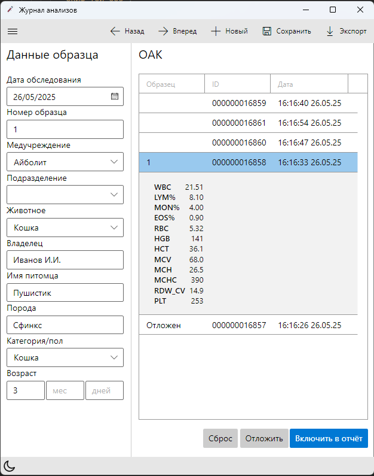
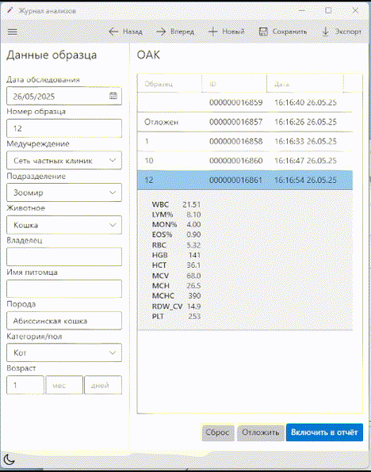

# Lab Test Browser

A WPF desktop application for small veterinary laboratories designed to streamline the process of managing and exporting
blood test results. Originally developed as a prototype for a real-world lab technician working with animals and humans,
this project evolved into a showcase demonstrating clean architecture principles and high code maintainability.



---

## Key Features

- **History-aware navigation** by lab order date and number
- **Manual pairing of results and patients** based on timestamp and test order
- **Document templating engine**: supports Word and Excel with dynamic token substitution
- **Autocomplete** for breeds, categories, and animal types
- **Clinic-specific template filter** based on selected clinic
- **Dark/light themes** with single-button toggle
- **Persistent data** with SQLite for long-term storage
- **Built-in HL7 device emulator** to simulate analyzer data input
- **Export to disk** with file sanitization and flexible naming conventions

---

## Demo

Bidirectional selection between report data and lab results in action.
Incoming observation results are processed, then saved and exported



---

## Background & Motivation

While observing a biochemistry specialist manually transcribe blood analyzer output into Word and Excel documents, it
became apparent that an enormous amount of time was wasted on repetitive, low-skill work. Inspired by this inefficiency,
I initiated development of a desktop tool that could:

- Receive HL7 messages from blood analyzers
- Pair results with patient data via a simple UI
- Automatically generate print-ready documents
- Adapt to different lab clients and templates with minimal configuration

The initial prototype reduced report preparation time from **2 hours to under 1**, eliminating hundreds of keystrokes
and potential transcription errors.

---

## Architecture & Technologies

This project applies Clean Architecture and DDD-inspired patterns in the context of a desktop application:

- **Clean Architecture** with distinct layers:
    - `Core`: entities, value objects, notification service and validation error codes
    - `UseCases`: use cases, MediatR commands/queries
    - `Infrastructure`: template rendering, HL7 device integration, file handling
    - `Desktop`: WPF UI, localization resources, dependency injection setup
- **DDD patterns** applied:
    - Entities enforce business rules and maintain invariants
    - Value objects encapsulate validation and consistent state
    - Repositories abstract persistence
    - Specifications express filtering logic in a reusable way
- **.NET 9 & WPF** with IHost-based startup (`Microsoft.Extensions.Hosting`)
    - Implements a ViewModel-first pattern with navigation
    - Responsive layout and basic theming
- **Localization-ready UI** (easily extendable via `.resx` resources)
- **Expandable HL7 MLLP device support**: adding a new device involves only domain mapping

---

## Emulation

An HL7 over TCP emulator is bundled, allowing demonstration of analyzer integration without physical devices.

---

## Repository Structure

```plaintext
/
├── docs/                  # Documentation and token reference
│   ├─screenshots/         # Demo screenshots and gif
│   └─ TokenReference.md
│
├── simulators/            # Device simulators
├── src/                   # Main application sources
│   ├─ Core/
│   ├─ UseCases/
│   ├─ Infrastructure/
│   └─ Desktop/            # WPF app with resources
│
├── templates/             # Ready-to-use document templates and example data
├── tests/                 # xUnit tests for domain and infrastructure 
└── README.md
```

---

## Configuration & Extensibility

- Animal settings defining animal type, breed, and categories is stored in `animalsettings.json`.
- A fully localized example list is available in `templates/animalsettings.json`.
- Templates for export documents (`.docx`, `.xlsx`) are located in `templates/`.
- Labs can define their own templates and connect them via config.

---

## Usage

1. Launch the app
2. Connect analyzer or emulator (URIT-5160 format supported)
3. Register patient data
4. Match incoming test results via timestamp-based UI
5. Export document with correct template preselected
6. Print or archive generated files

---

## Branches

- `main`: clean showcase version with ~20 feature-focused commits
- `history`: original development history with partial preservation of commit evolution

---

## Roadmap

- [ ] Add patient search and result history
- [ ] Add new analyzer integration via HL7
- [ ] Add support for English language UI
- [ ] Enable multi-user profiles with shared SQLite instance

---

## License

MIT
